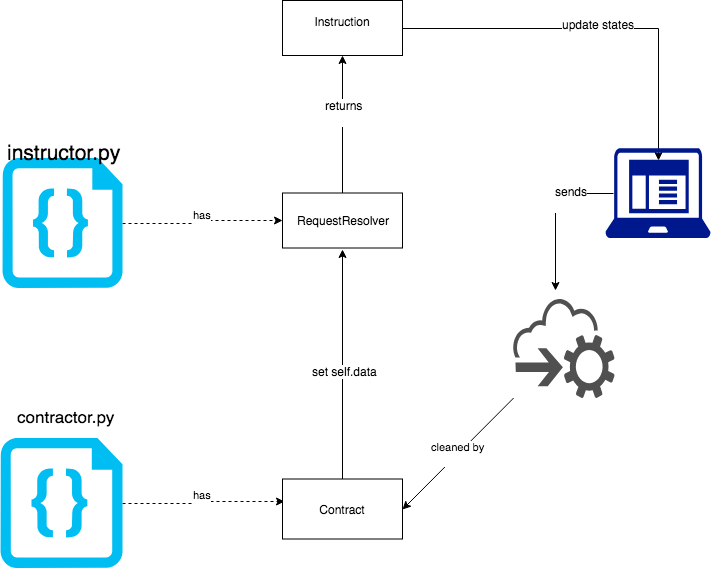

# Slotomania
0.0.37 is the last version that supports marshmallow schemas.

A code generator that transforms schemas to Python slot classes and typescript interfaces.

# Examples
see [test_contract.py](slotomania/tests/test_contract.py)

