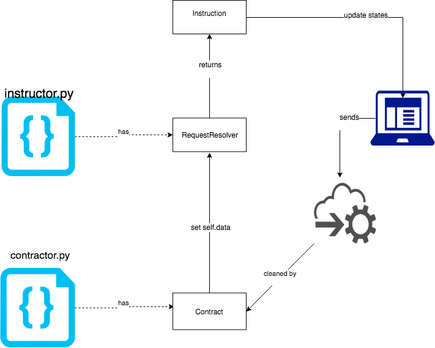

.. image:: https://codecov.io/gh/conanfanli/slotomania/branch/master/graph/badge.svg
   :target: https://codecov.io/gh/conanfanli/slotomania
   :alt: codecov

.. image:: https://pyup.io/repos/github/conanfanli/slotomania/shield.svg
   :target: https://pyup.io/repos/github/conanfanli/slotomania/shield.svg
   :alt: pyup

Slotomania
==========

0.0.37 is the last version that supports marshmallow schemas.

A code generator that transforms schemas to Python slot classes and typescript interfaces.

Examples
========

see `test_contract.py <slotomania/tests/test_contract.py>`_
